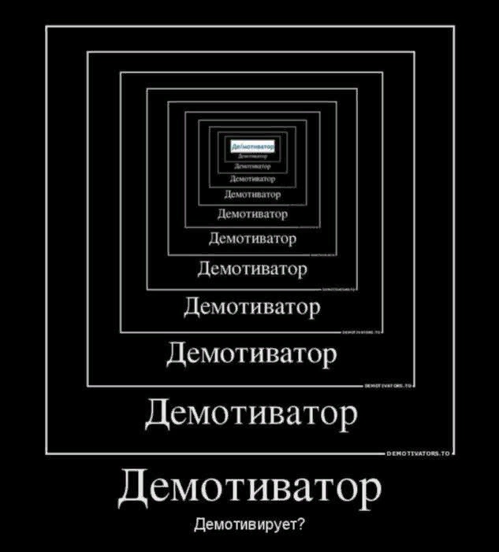

# surf-flutter-study-jam-5

## Требования к приложению

- Версия Flutter: **3.16.3**
- Версия Dart: **3.2.3**

Ваша ветка с выполнением задания называется `study-jam-5`.

В шаблонном приложении у вас уже есть начальный экран с заготовкой для базового уровня сложности.

Эмоджи 🔥 показывает задание повышеной сложности.

---

## Описание фичи

Однажды, проснувшись, вы почувствовали, что хотите сделать мир вокруг вас лучше. Сделать свой вклад в развитие человечества. И тут вы вспомнили, что у вас есть знания Flutter и вы можете сделать приложение, которое поможет людям. И вот вы здесь. Чтобы написать приложение, которое позволяет генерировать мемы. 

## Техническое задание

В общем смысле приложение представляет из себя конструктор для генерации картинок, позволяющий оперировать картинками и текстом. 

### Способ взаимодействия с текстом

Взаимодействие с текстом происходит путём нажатия на него. Вы также можете реализовать любые необходимые для удобства пользователя кнопки/маркеры, по которым можно нажимать для редактирования текста - как для смены самого содержимого текста, так и для изменения размера шрифта, перемещения и тд.

### Способ взаимодействия с изображением

Взаимодействие с изображением происходит аналогично подобным действиям с текстом. 

## Уровни сложности

Задание имеет несколько уровней сложности, в каждом из которых приложение может быть реализовано по-разному.

> [!NOTE]
> Крайне рекомендуем вам прочесть все задания до конца прежде чем приступать к выполнению.

### **Базовый уровень**

На этом уровне ваша цель реализовать простой генератор [демотиватора](https://ru.wikipedia.org/wiki/%D0%94%D0%B5%D0%BC%D0%BE%D1%82%D0%B8%D0%B2%D0%B0%D1%82%D0%BE%D1%80). Пример демотиватора можно увидеть ниже:

Приложение состоит только из одного экрана - экрана, на котором происходит создание демотиватора.

Функционал должен включать:
- возможность выбрать картинку из интернета (например, по ссылке)
- возможность ввести текст;

### **Средний уровень**🔥

К тем требованиям, которые были на базовом уровне, добавляется:
- возможность выбирать картинки из галереи;
- возможность делиться полученным демотиватором (картинкой).

### **Продвинутый уровень**🔥🔥

Этот уровень уже подразумевает наличие двух экранов: экрана создания мема и экрана со списком доступных шаблонов для мема. 

> [!NOTE]
> Если у вас есть другое видение организации экранов приложения (например, совместить всё на одном экране, сделав карусель шаблонов или использовав Drawer), то вы можете реализовать его так, как считаете нужным.

Функционал должен включать:
- экран со списком доступных шаблонов;
- возможность выбрать шаблон из списка и перейти на экран создания мема с выбранным шаблоном.
- шаблон представляет из себя:
  - картинку;
  - текстовые поля, которые можно редактировать (их местоположение и количество будут варьироваться в зависимости от шаблона);

На данном уровне сложности вы вольны использовать хардкод для задания позиции картинок/текстовых полей или задавать их динамически (что пригодится вам в следующих уровнях сложности).

### **Очень продвинутый уровень**🔥🔥🔥🔥

На этом уровне приложение уже будет иметь три экрана: экран со списком шаблонов, экран создания мема и экран создания нового шаблона. 

Функционал должен включать:
- всё перечисленное в среднем уровне;
- экран создания нового шаблона;

> [!NOTE]
> Обратите внимание!
> Если вы планируете выполнять задание на этом уровне сложности и выше, исходите из того, что конфигурация каждого шаблона описывается динамически, а не хардкодом.

### **Уровень: Безумие**🔥🔥🔥🔥🔥

Функционал должен включать:
- хранение шаблонов в локальной базе данных (используйте любую библиотеку для хранения постоянных данных, которую посчитаете нужным использовать);

### Бонусные задания

 - **CRUD для шаблонов (создание, чтение, обновление, удаление)** 🔥🔥 - при условии, что вы реализовали хранение шаблонов в локальной базе данных ([продвинутый уровень](#продвинутый-уровень🔥🔥🔥));
 - **Масштабирование и позиционирование картинки в шаблоне** 🔥🔥 - приложение позволяет масштабировать и позиционировать картинку в шаблоне с помощью жестов;
 - **Адаптив под альбомную ориентацию, десктоп и веб** 🔥🔥🔥 - приложение корректно запускается и отображается в альбомной ориентации, на десктопе и в вебе;
 - **Адаптация размера шрифта под размер текстового поля** 🔥🔥🔥🔥 - текст корректно помещается в выделенной в шаблоне области и меняет свой размер при необходимости.

# Представление результатов

Умение защитить результаты своей работы - невероятно важный навык для разработчика.

В текущем проекте есть файл `/docs/results/RESULT.md`. Этот шаблон нужен как раз для того, чтобы вы могли поделиться результатами вашей работы. Вы можете записать скринкаст, сделать скриншоты или целый README-файл, в котором будет описано, что вы успели сделать.

Это один из критериев, по которому будет оцениваться ваша работа!
