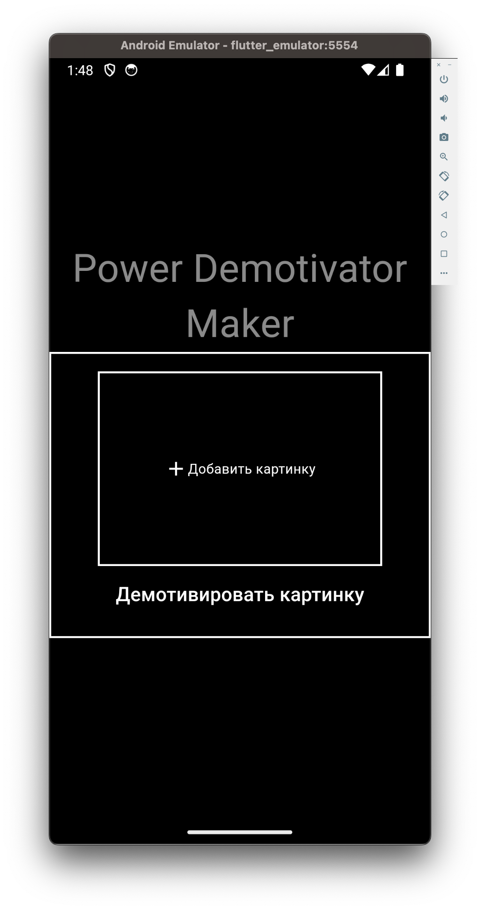
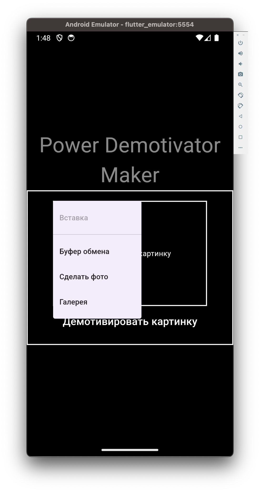
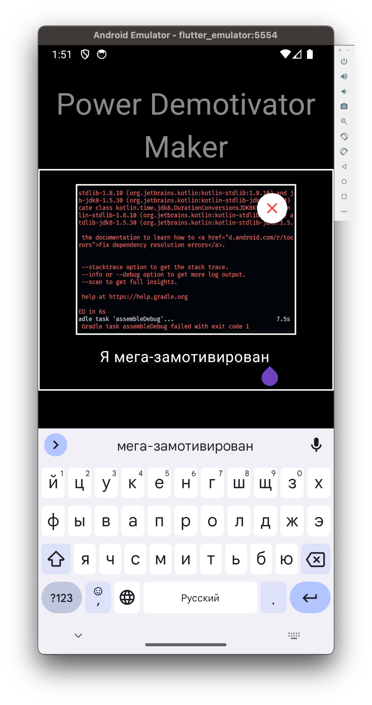
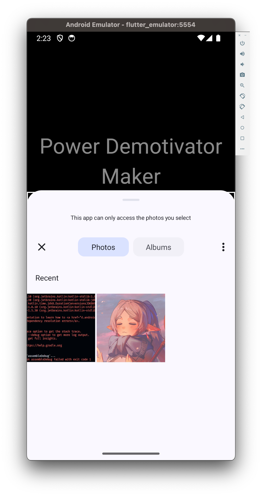
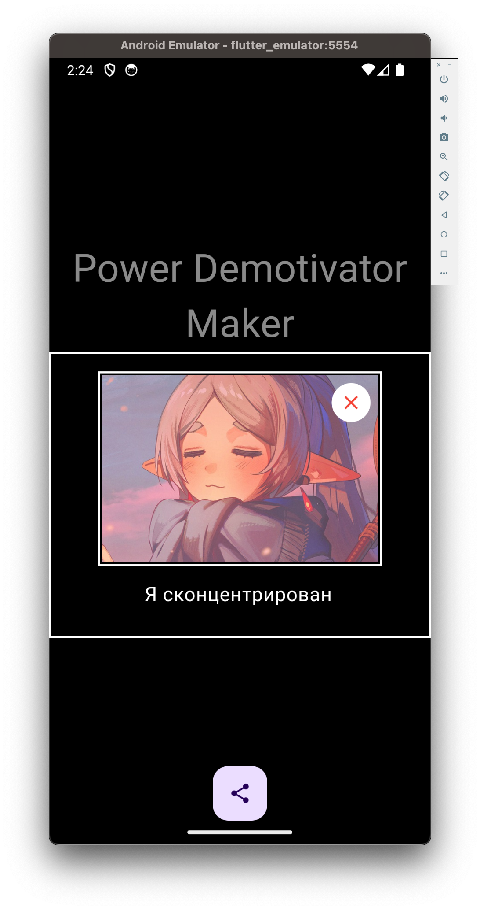
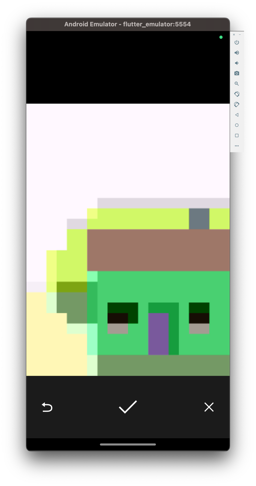
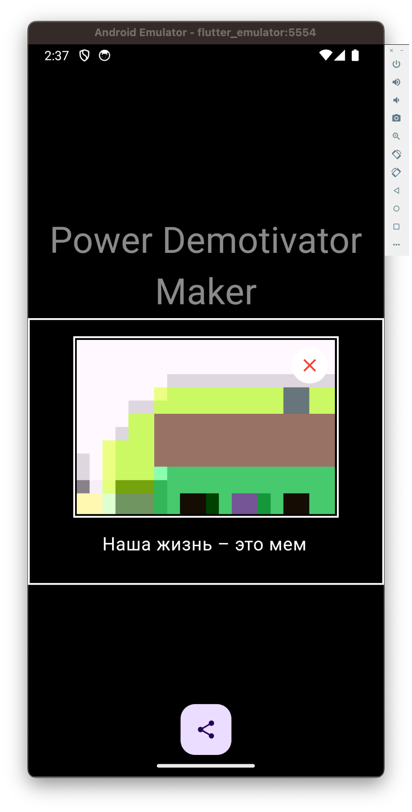
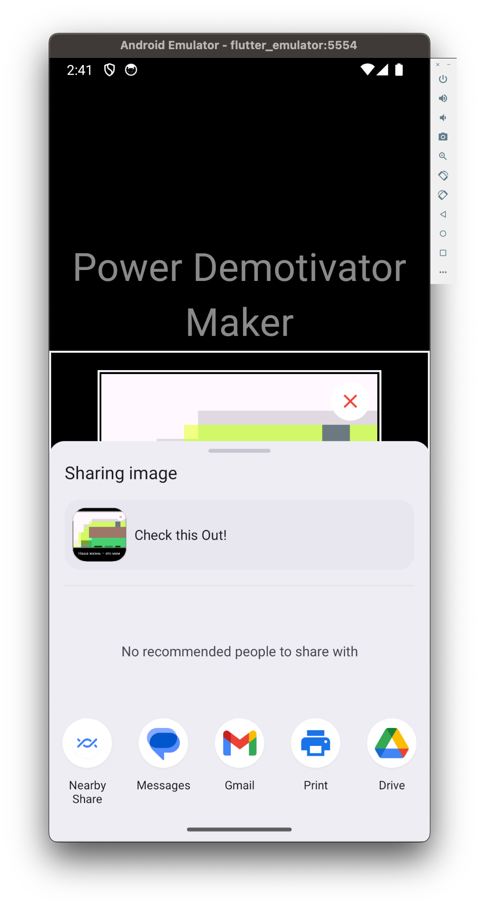

### Шорткаты
- [Проделанная работа](#проделанная-работа)
- [Showcase (скриншоты)](#showcase)
- [Послесловие](#послесловие)

# Проделанная работа

Результатом проделанной работы стало приложение Power Demotivator Maker, выполненное в минималистичном стиле.

<video height="512" controls>
  <source src="../screencasts/meme_demo_screencast.mp4" type="video/mp4">
</video>

### **Базовый уровень:**

✅ Возможность выбрать картинку из интернета (например, по ссылке)

При нажатии на кнопку «+ Добавить картинку» открывается выпадающее меню
с вариантами вставки картинок. В том числе и вариант вставки url из буфера обмена. Я посчитал такой вариант более удобным, чем вставлять ссылку в какой-либо TextField. 

*Единственное, не успел проработать сценарий, когда в буфере обмена находится не ссылка, а изображение.*

✅ Возможность ввести текст

Тут без особых комментариев. Обычный TextField.

*Не успел проработать момент с уменьшением текста по мере увеличения количества введённых символов. Планировал обыграть этот момент через виджет FittedBox.*

### **Средний уровень**🔥

✅ Возможность выбирать картинки из галереи

Реализация с использованием библиотеки image_picker.

✅ Дополнительно: Возможность сделать фото и сразу же использовать его

Наша жизнь – сплошной мем, поэтому очень удобно оперативно сделать фото и сорвать хайп на свежем мемесе.

✅ Возможность делиться полученным демотиватором (картинкой)

Реализация с использованием библиотек share и path_provider.

Стандартная кнопка «Поделиться», позволяющая, внезапно, поделиться созданным контентом. Для «захвата» виджета и конвертации его в картинку используется виджет RepaintBoundary и метод RenderRepaintBoundary.toImage().

*Уже когда запушил проект в последние минуты, заметил, что на получившуюся картинку попадает крестик, используемый для очистки шаблона от изображения… :)*

# Послесловие

К сожалению, не смог выделить на выполнение задачи достаточно времени. Будний день, все дела.
Реально тут представлен резульат работы примерно за 2 часа. Соответственно, код, на момент наступления дедлайна, находится в состоянии «черновик». :) За отведённые 7 часов, конечно, можно было бы успеть намного больше.

В проекте всё сделано в одном файле без вынесения кода в отдельные файлы. Виджеты в дереве не вынесены в отдельные классы для улучшения читаймости кода, производительности, переиспользоваемости… Это понятно.
Слой логики также смешан со слоем UI. По-хорошему, я бы вынес логику в Cubit и в слое UI уже отобажал всё, опираясь на текущий стейт Cubit'а.
